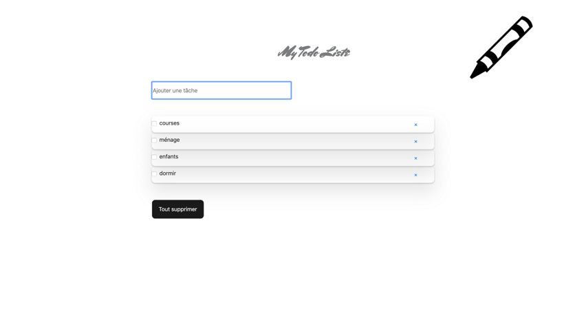

# Todolistevue

Réalisation d'une To do liste

## Date :

Effectué la semaine du 1 au 5 avril 2019 en tant que stagiaire chez BeCode

## Technologies utilisées :

+ HTML
+ CSS (BOOTSTRAP)
+ JAVASCRIPT (vuejs)
+ Gsap
+ Axios

## Progression :

Terminé

## Liens utiles :

lien github page : (https://doropro.github.io/Todolistevue/dist)

## Aperçu du site : 
